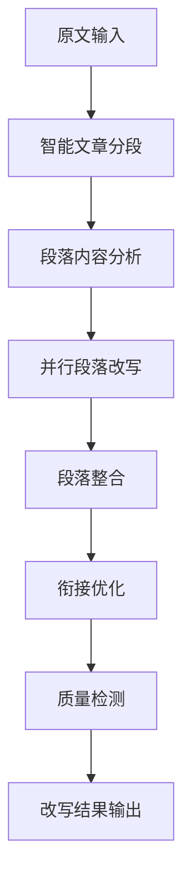
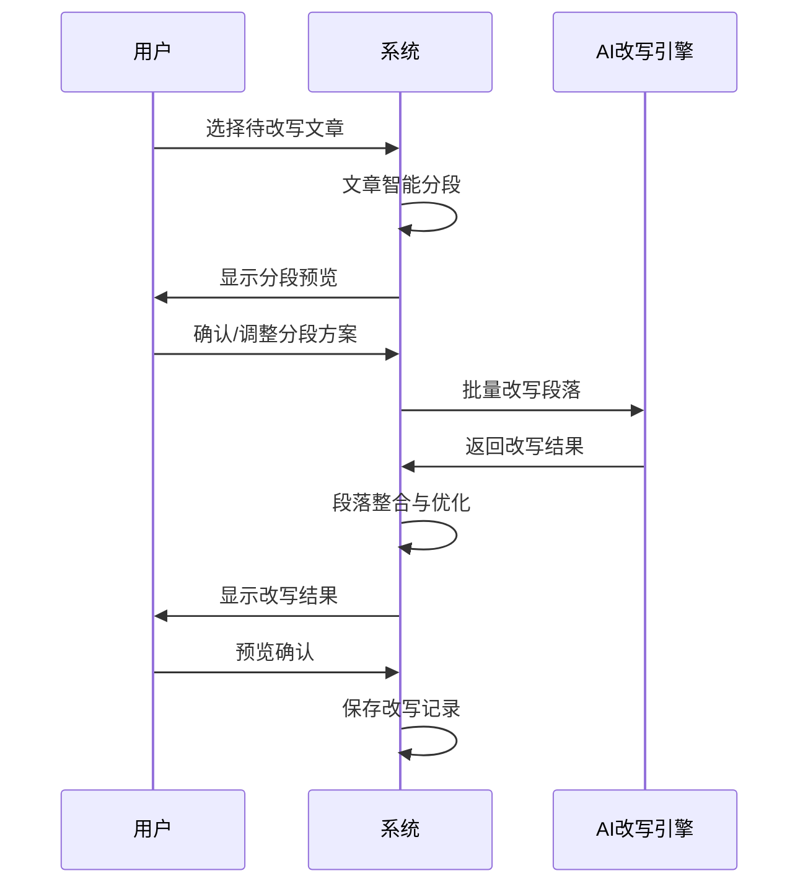
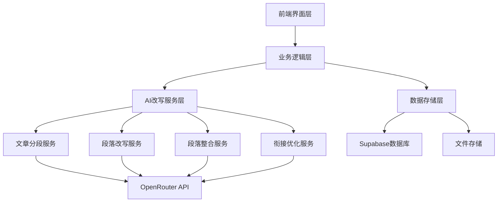
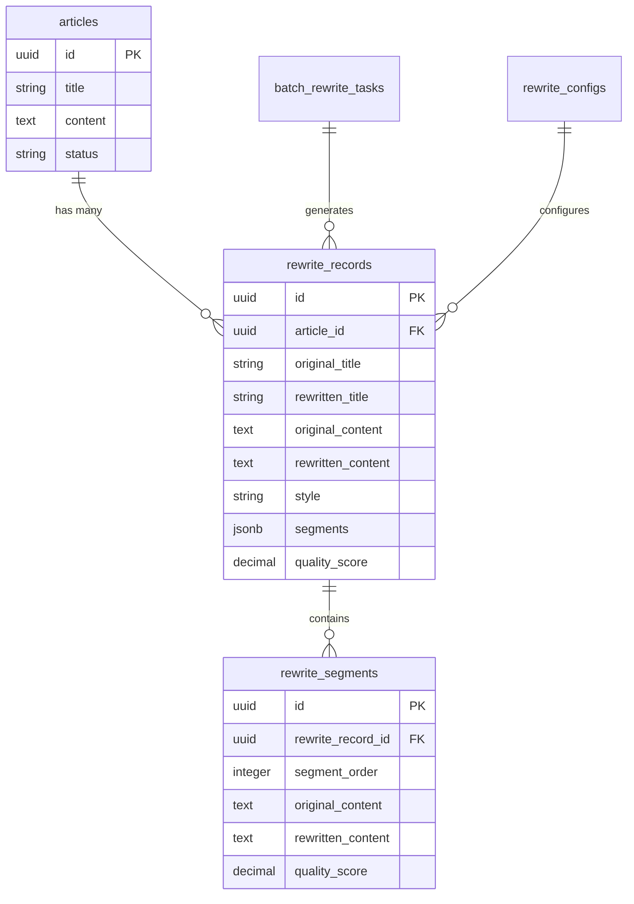

# AI智能改写模块产品需求文档（PRD）

## 1. 产品概述

### 1.1 产品背景
微信内容管理系统的第三阶段核心功能，旨在通过AI技术对采集的热门内容进行智能化改写，解决原创性问题，提升内容质量和表达效果。

### 1.2 产品定位
- **目标用户**：内容创作者、公众号运营者
- **核心价值**：利用AI技术实现内容的智能化改写，保持李诞式幽默风格的独特表达
- **产品目标**：将原始素材转化为具有独特风格的高质量原创内容

### 1.3 核心优势
1. **分段式改写**：避免整篇改写质量不均的问题
2. **李诞风格**：集成专业的李诞式表达提示词
3. **段落优化**：智能优化段落间的衔接流畅度
4. **质量保障**：多重检测确保改写质量和一致性

## 2. 功能需求详述

### 2.1 核心功能架构

#### 2.1.1 分段式改写系统


#### 2.1.2 李诞风格提示词集成
- **提示词源文件**：`.docs/prompts/lidan.md`
- **应用方式**：每个段落改写时融入李诞式表达特色
- **风格要素**：
  - 反讽与幽默
  - 生活哲学探讨
  - 现实主义观察
  - 个人性与普遍性结合
  - 精准的语言表达
  - 自我反思与批评
  - 寓教于乐

### 2.2 详细功能规格

#### 2.2.1 文章智能分段
**功能描述**：将长文章智能切分为若干段落，确保每段内容完整且适合独立改写。

**分段策略**：
1. **语义分段**：基于文本语义理解进行自然分段
   - 段落标识符识别（换行符、段落标记）
   - 语义连贯性分析
   - 主题转换点检测

2. **长度分段**：控制单段长度，优化改写效果
   - 单段最大字数：300-500字
   - 单段最小字数：50字
   - 超长段落自动拆分

3. **结构分段**：保持文章结构完整性
   - 保留标题、副标题结构
   - 识别列表、引用等特殊结构
   - 维持逻辑层次关系

**技术实现要点**：
- 使用自然语言处理技术识别段落边界
- 实现基于规则和机器学习的混合分段算法
- 支持用户手动调整分段结果

#### 2.2.2 段落并行改写
**功能描述**：对每个段落独立进行AI改写，融入李诞风格特色。

**改写流程**：
1. **段落预处理**
   - 提取段落关键信息
   - 分析段落类型（叙述、议论、说明等）
   - 识别需要保留的专有名词、数据等

2. **李诞风格改写**
   - 融入反讽幽默元素
   - 添加生活哲学思考
   - 运用现实主义表达
   - 保持语言精准度

3. **改写质量控制**
   - 内容完整性检查
   - 风格一致性验证
   - 长度适宜性控制

**并行处理优势**：
- 提升改写效率
- 降低单次API调用压力
- 支持断点续写功能

#### 2.2.3 段落整合系统
**功能描述**：将改写后的段落重新组合成完整文章。

**整合要求**：
- 保持原文逻辑结构
- 确保段落顺序正确
- 维护内容连贯性
- 统一格式风格

**整合步骤**：
1. 按原始顺序排列改写段落
2. 检查段落间逻辑关系
3. 调整段落间距和格式
4. 生成完整改写文章

#### 2.2.4 段落衔接优化
**功能描述**：优化段落间的过渡和衔接，确保文章流畅度。

**优化策略**：
1. **衔接词优化**
   - 添加适当的过渡词语
   - 优化段落首尾句表达
   - 保持李诞式表达风格

2. **逻辑关系强化**
   - 检测段落间逻辑断层
   - 修复逻辑跳跃问题
   - 增强论证连贯性

3. **风格统一化**
   - 统一语言风格
   - 平衡幽默密度
   - 保持整体调性

**技术实现**：
- 使用语言模型分析段落衔接质量
- 实现自动衔接词建议功能
- 支持人工干预调整

### 2.3 辅助功能

#### 2.3.1 改写预览与对比
- **实时预览**：分段改写过程可视化
- **对比分析**：原文与改写结果对比
- **质量评估**：改写质量量化评分
- **风格检测**：李诞风格融入程度评估

#### 2.3.2 改写历史管理
- **版本控制**：支持多版本改写结果保存
- **回滚功能**：可回退到任意历史版本
- **改写记录**：详细记录每次改写参数和结果
- **模板保存**：保存成功的改写风格模板

#### 2.3.3 批量改写支持
- **批量选择**：支持多文章同时改写
- **队列管理**：改写任务队列化处理
- **进度跟踪**：实时显示批量改写进度
- **异常处理**：单篇失败不影响整体进度

## 3. 用户场景与流程

### 3.1 典型用户场景

#### 场景1：单篇文章改写
1. 用户从素材库选择待改写文章
2. 系统自动分析文章并提供分段预览
3. 用户确认分段方案或手动调整
4. 系统并行改写各段落（融入李诞风格）
5. 自动整合段落并优化衔接
6. 用户预览改写结果并确认保存

#### 场景2：批量文章改写
1. 用户选择多篇待改写文章
2. 系统创建改写任务队列
3. 逐篇执行分段式改写流程
4. 实时显示改写进度和结果
5. 用户批量审核改写质量
6. 确认保存改写结果

#### 场景3：改写结果优化
1. 用户对改写结果不满意
2. 调整改写参数（风格强度、分段方式等）
3. 重新执行改写流程
4. 对比多个改写版本
5. 选择最佳版本保存

### 3.2 用户操作流程



## 4. 技术架构设计

### 4.1 系统架构



### 4.2 核心技术组件

#### 4.2.1 文章分段引擎
- **输入**：完整文章文本
- **处理**：语义分析、结构识别、长度控制
- **输出**：段落数组，包含段落内容和元数据

#### 4.2.2 AI改写引擎
- **模型选择**：OpenRouter平台的高质量语言模型
- **提示词模板**：基于李诞风格的改写提示词
- **并发控制**：支持多段落并行改写
- **质量控制**：内容完整性和风格一致性检查

#### 4.2.3 段落整合引擎
- **整合算法**：保持原文结构的段落重组
- **衔接优化**：自动检测和优化段落间连接
- **格式处理**：统一段落格式和样式

### 4.3 性能优化策略

#### 4.3.1 并行处理优化
- **段落并行改写**：提升改写效率
- **批量请求优化**：减少API调用延迟
- **缓存机制**：常用段落改写结果缓存

#### 4.3.2 错误处理与重试
- **段落级重试**：单段改写失败时自动重试
- **降级策略**：AI服务异常时的备用方案
- **进度保护**：改写过程中断后可继续执行

## 5. API接口设计

### 5.1 核心API接口

#### 5.1.1 段落分析接口
```typescript
POST /api/rewrite/analyze-segments
```

**请求参数**：
```typescript
{
  articleId: string;
  content: string;
  segmentStrategy: 'semantic' | 'length' | 'structure';
  maxSegmentLength?: number;
}
```

**响应结果**：
```typescript
{
  segments: Array<{
    id: string;
    content: string;
    order: number;
    type: 'paragraph' | 'title' | 'list';
    metadata: {
      wordCount: number;
      keyPhrases: string[];
    };
  }>;
  totalSegments: number;
}
```

#### 5.1.2 分段改写接口
```typescript
POST /api/rewrite/rewrite-segments
```

**请求参数**：
```typescript
{
  articleId: string;
  segments: Array<{
    id: string;
    content: string;
    order: number;
  }>;
  style: 'lidan'; // 李诞风格
  customPrompt?: string;
  batchSize?: number;
}
```

**响应结果**：
```typescript
{
  rewrittenSegments: Array<{
    id: string;
    originalContent: string;
    rewrittenContent: string;
    order: number;
    quality: {
      score: number;
      issues: string[];
    };
  }>;
  overallQuality: {
    styleConsistency: number;
    contentCompleteness: number;
    readability: number;
  };
}
```

#### 5.1.3 段落整合接口
```typescript
POST /api/rewrite/integrate-segments
```

**请求参数**：
```typescript
{
  articleId: string;
  rewrittenSegments: Array<{
    id: string;
    content: string;
    order: number;
  }>;
  optimizeTransitions: boolean;
}
```

**响应结果**：
```typescript
{
  integratedContent: {
    title: string;
    content: string;
    wordCount: number;
  };
  transitionOptimizations: Array<{
    position: number;
    suggestion: string;
    applied: boolean;
  }>;
  quality: {
    coherence: number;
    fluency: number;
    styleUniformity: number;
  };
}
```

#### 5.1.4 改写质量评估接口
```typescript
POST /api/rewrite/evaluate-quality
```

**请求参数**：
```typescript
{
  originalContent: string;
  rewrittenContent: string;
  style: string;
}
```

**响应结果**：
```typescript
{
  qualityScore: {
    overall: number;
    originality: number;
    styleConsistency: number;
    contentCompleteness: number;
    readability: number;
  };
  suggestions: Array<{
    type: 'improvement' | 'warning' | 'error';
    message: string;
    position?: number;
  }>;
}
```

### 5.2 辅助API接口

#### 5.2.1 改写配置管理
```typescript
GET /api/rewrite/config
PUT /api/rewrite/config
```

#### 5.2.2 改写历史查询
```typescript
GET /api/rewrite/history/{articleId}
GET /api/rewrite/history/list
```

#### 5.2.3 批量改写管理
```typescript
POST /api/rewrite/batch/start
GET /api/rewrite/batch/status/{batchId}
POST /api/rewrite/batch/cancel/{batchId}
```

## 6. 数据模型设计

### 6.1 核心数据表

#### 6.1.1 改写记录表（rewrite_records）
```sql
CREATE TABLE rewrite_records (
  id UUID PRIMARY KEY DEFAULT gen_random_uuid(),
  article_id UUID REFERENCES articles(id) ON DELETE CASCADE,
  original_title VARCHAR(500) NOT NULL,
  rewritten_title VARCHAR(500) NOT NULL,
  original_content TEXT NOT NULL,
  rewritten_content TEXT NOT NULL,
  style VARCHAR(50) NOT NULL DEFAULT 'lidan',
  custom_prompt TEXT,
  
  -- 分段改写相关字段
  segments JSONB, -- 存储分段信息
  segment_strategy VARCHAR(20), -- 分段策略
  rewrite_method VARCHAR(20) DEFAULT 'segmented', -- 改写方法
  
  -- 质量评估字段
  quality_score DECIMAL(3,2),
  style_consistency DECIMAL(3,2),
  content_completeness DECIMAL(3,2),
  readability DECIMAL(3,2),
  
  -- AI模型信息
  ai_model VARCHAR(100),
  processing_time INTEGER, -- 处理时间（毫秒）
  
  -- 时间戳
  created_at TIMESTAMP DEFAULT NOW(),
  updated_at TIMESTAMP DEFAULT NOW()
);

-- 索引
CREATE INDEX idx_rewrite_records_article_id ON rewrite_records(article_id);
CREATE INDEX idx_rewrite_records_style ON rewrite_records(style);
CREATE INDEX idx_rewrite_records_quality ON rewrite_records(quality_score);
```

#### 6.1.2 分段详情表（rewrite_segments）
```sql
CREATE TABLE rewrite_segments (
  id UUID PRIMARY KEY DEFAULT gen_random_uuid(),
  rewrite_record_id UUID REFERENCES rewrite_records(id) ON DELETE CASCADE,
  segment_order INTEGER NOT NULL,
  original_content TEXT NOT NULL,
  rewritten_content TEXT NOT NULL,
  segment_type VARCHAR(20) DEFAULT 'paragraph',
  
  -- 段落质量评估
  quality_score DECIMAL(3,2),
  processing_time INTEGER,
  retry_count INTEGER DEFAULT 0,
  
  -- 元数据
  metadata JSONB,
  
  created_at TIMESTAMP DEFAULT NOW()
);

-- 索引
CREATE INDEX idx_rewrite_segments_record_id ON rewrite_segments(rewrite_record_id);
CREATE INDEX idx_rewrite_segments_order ON rewrite_segments(rewrite_record_id, segment_order);
```

#### 6.1.3 批量改写任务表（batch_rewrite_tasks）
```sql
CREATE TABLE batch_rewrite_tasks (
  id UUID PRIMARY KEY DEFAULT gen_random_uuid(),
  name VARCHAR(200),
  article_ids UUID[] NOT NULL,
  style VARCHAR(50) NOT NULL,
  custom_prompt TEXT,
  
  -- 任务状态
  status VARCHAR(20) DEFAULT 'pending' 
    CHECK (status IN ('pending', 'processing', 'completed', 'failed', 'cancelled')),
  
  -- 进度信息
  total_articles INTEGER NOT NULL,
  completed_articles INTEGER DEFAULT 0,
  failed_articles INTEGER DEFAULT 0,
  
  -- 配置信息
  config JSONB,
  
  -- 时间信息
  started_at TIMESTAMP,
  completed_at TIMESTAMP,
  created_at TIMESTAMP DEFAULT NOW(),
  
  -- 错误信息
  error_message TEXT
);

-- 索引
CREATE INDEX idx_batch_tasks_status ON batch_rewrite_tasks(status);
CREATE INDEX idx_batch_tasks_created ON batch_rewrite_tasks(created_at);
```

#### 6.1.4 改写配置表（rewrite_configs）
```sql
CREATE TABLE rewrite_configs (
  id UUID PRIMARY KEY DEFAULT gen_random_uuid(),
  config_key VARCHAR(100) UNIQUE NOT NULL,
  config_value JSONB NOT NULL,
  description TEXT,
  created_at TIMESTAMP DEFAULT NOW(),
  updated_at TIMESTAMP DEFAULT NOW()
);

-- 插入默认配置
INSERT INTO rewrite_configs (config_key, config_value, description) VALUES
('segment_strategy', '"semantic"', '默认分段策略'),
('max_segment_length', '400', '最大段落长度'),
('min_segment_length', '50', '最小段落长度'),
('batch_size', '5', '批量改写并发数'),
('quality_threshold', '0.7', '质量阈值'),
('style_templates', '{"lidan": "李诞风格改写"}', '风格模板配置');
```

### 6.2 数据关系图



## 7. 性能要求

### 7.1 响应时间要求
- **文章分段分析**：< 2秒
- **单段落改写**：< 10秒
- **完整文章改写**：< 60秒（取决于文章长度）
- **批量改写**：支持队列处理，无时间限制

### 7.2 并发处理能力
- **同时改写任务数**：≤ 10个
- **段落并行处理数**：≤ 5个
- **API请求频率**：遵循OpenRouter限制

### 7.3 质量指标
- **改写质量分数**：≥ 0.8
- **风格一致性**：≥ 0.85
- **内容完整性**：≥ 0.9
- **可读性评分**：≥ 0.8

### 7.4 可靠性要求
- **系统可用性**：99.5%
- **改写成功率**：≥ 95%
- **数据一致性**：100%
- **错误恢复时间**：< 30秒

## 8. 开发计划与里程碑

### 8.1 开发阶段规划

#### 第一阶段：基础架构开发（2天）
- **任务清单**：
  - [ ] 创建数据库表结构
  - [ ] 设计API接口框架
  - [ ] 实现文章分段算法
  - [ ] 集成OpenRouter AI接口
  - [ ] 创建基础前端页面

- **验收标准**：
  - 数据库表创建完成且通过测试
  - API接口框架搭建完成
  - 能够对文章进行基本分段
  - OpenRouter连接测试通过

#### 第二阶段：核心功能实现（3天）
- **任务清单**：
  - [ ] 实现李诞风格改写逻辑
  - [ ] 开发段落并行改写功能
  - [ ] 实现段落整合算法
  - [ ] 开发衔接优化功能
  - [ ] 创建改写质量评估系统

- **验收标准**：
  - 能够成功改写单篇文章
  - 改写结果体现李诞风格特色
  - 段落衔接流畅自然
  - 质量评估功能正常工作

#### 第三阶段：用户界面完善（2天）
- **任务清单**：
  - [ ] 完善改写操作界面
  - [ ] 实现改写预览和对比功能
  - [ ] 开发改写历史管理
  - [ ] 添加批量改写支持
  - [ ] 优化用户体验

- **验收标准**：
  - 界面操作流畅直观
  - 改写过程可视化
  - 支持改写结果对比
  - 批量改写功能正常

#### 第四阶段：性能优化与测试（1天）
- **任务清单**：
  - [ ] 性能测试和优化
  - [ ] 错误处理完善
  - [ ] 并发控制优化
  - [ ] 全面功能测试
  - [ ] 用户体验优化

- **验收标准**：
  - 满足性能指标要求
  - 错误处理机制完善
  - 通过完整功能测试
  - 用户反馈良好

### 8.2 关键里程碑

| 里程碑 | 时间节点 | 主要交付物 | 验收标准 |
|--------|----------|------------|----------|
| M1 | Day 2 | 基础架构 | API框架、数据库、分段算法 |
| M2 | Day 5 | 核心功能 | 完整改写流程、质量评估 |
| M3 | Day 7 | 完整系统 | 用户界面、批量处理 |
| M4 | Day 8 | 系统优化 | 性能优化、测试完成 |

### 8.3 风险与应对

#### 技术风险
1. **AI API限制风险**
   - 风险：OpenRouter API调用频率限制
   - 应对：实现请求队列和重试机制

2. **改写质量风险**
   - 风险：AI改写结果不符合预期
   - 应对：多轮提示词优化和质量检测

3. **性能瓶颈风险**
   - 风险：长文章改写时间过长
   - 应对：优化分段策略和并行处理

#### 业务风险
1. **用户体验风险**
   - 风险：操作流程复杂
   - 应对：简化交互流程，增加引导

2. **内容质量风险**
   - 风险：改写内容失去原意
   - 应对：增强质量检测和用户确认机制

## 9. 成功标准

### 9.1 功能完整性
- ✅ 分段式改写功能完整实现
- ✅ 李诞风格完美融入
- ✅ 段落衔接自然流畅
- ✅ 批量改写功能稳定
- ✅ 改写历史管理完善

### 9.2 性能指标
- ✅ 单篇文章改写时间 < 60秒
- ✅ 改写质量分数 ≥ 0.8
- ✅ 系统响应速度 < 3秒
- ✅ 并发处理能力满足需求

### 9.3 用户体验
- ✅ 操作流程直观简单
- ✅ 改写过程可视化
- ✅ 错误处理友好
- ✅ 用户满意度 ≥ 85%

### 9.4 技术质量
- ✅ 代码质量符合规范
- ✅ API接口设计合理
- ✅ 数据库设计规范
- ✅ 系统稳定性良好

---

## 附录：李诞风格改写示例

### 示例1：商业文案改写

**原文**：
"企业数字化转型已成为当前商业环境下的必然选择。通过引入先进的技术手段，企业可以提升运营效率，降低成本，增强竞争力。"

**李诞风格改写**：
"企业数字化转型，听起来很厉害吧？其实就是老板们发现，与其天天盯着员工干活，不如让电脑来盯着。最终的结果是，电脑比老板更了解员工在干什么，员工比电脑更了解老板在想什么，而老板，依然不知道钱去哪了。"

### 示例2：生活感悟改写

**原文**：
"现代人工作压力大，生活节奏快，很多人都感到焦虑和迷茫。我们应该学会放慢脚步，享受生活中的美好时光。"

**李诞风格改写**：
"现代人的生活，就像在跑步机上跑马拉松，拼命地跑着，却发现自己还在原地。大家都说要享受生活，但大部分时间我们连享受焦虑的时间都没有。放慢脚步？可以，但房贷不会因为你的哲学觉悟而放慢催收的脚步。"

---

*本PRD文档为AI智能改写模块的完整产品需求说明，涵盖了从需求分析到技术实现的全过程。开发团队应严格按照此文档进行功能实现，确保产品质量和用户体验。*